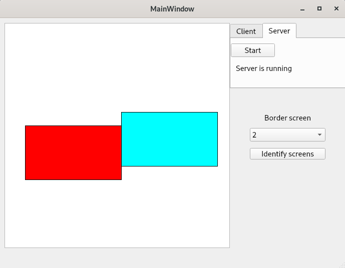
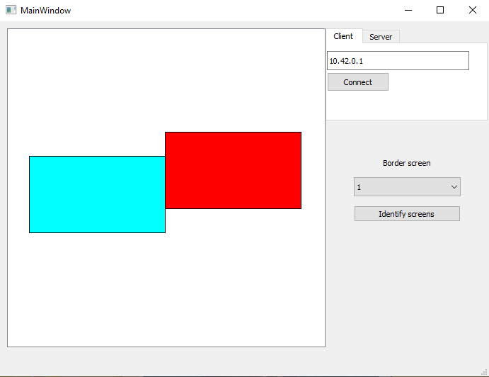

# PCs-connector

PCs-connector is an application that allows to use two computers with Linux and Windows with one mouse and one keyboard. Computers communicate with each other by TCP, so both computers have to be in the same network.

Usage:

1. Run pcs_connector.exe binary on the computer with Windows and pcs_connector binary on computer with Linux.
2. If you have multiple screens click **Identify screens** button and choose **Border screen** from the drop-down menu.
3. On Linux choose **Server** tab and click **Start** button.
4. On Windows choose **Client** tab, put IP of computer with Linux and click **Connect** button.
5. If both computers are connected properly two rectangles are shown in the application. The red one is the border screen of the computer that runs the application. Blue on is the border screen of the second computer. Change position of the rectangles to adjust border screen position.

### Linux app:  


### Windows app:  


## Build


### Linux:
In order to build Linux application you need some dependencies:
- Boost 1.70
- Qt 5.14.1

Unit tests:
- Google test

Integration tests:
- Python3
- Pytest

Optional:
- Ninja

Libraries path:  
Cmake will search for Boost, Qt and Google test in the paren directory or in directory specified in **PREFIX_DIR** environment variable. In both cases cmake will search for these three directories **boost_1_70_0**, **googletest**, **Qt**

Run cmake:
```
mkdir build && cd build
export PREFIX_DIR=/path/to/libraries
cmake -G Ninja ..
```

Build and run:
```
ninja build_run
```

Run unit tests:
```
ninja UT
```

Run integration tests:
```
ninja integr-tests
```

if python cannot find binary run:
```
CONNECTOR_BUILD_DIR=$(pwd) ninja integr-tests
```


### Windows:


### IDE:

Prefered IDE in this project is QtCreator because it allows easier gui modification

### Architecture:

[![architecture]architecture.pmg]
